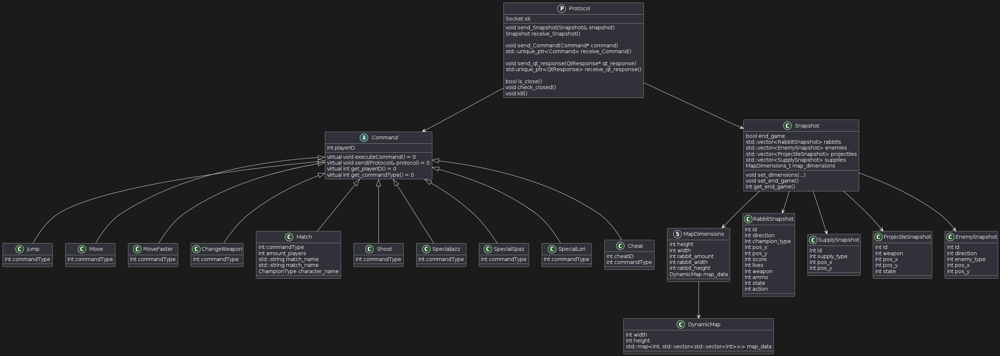
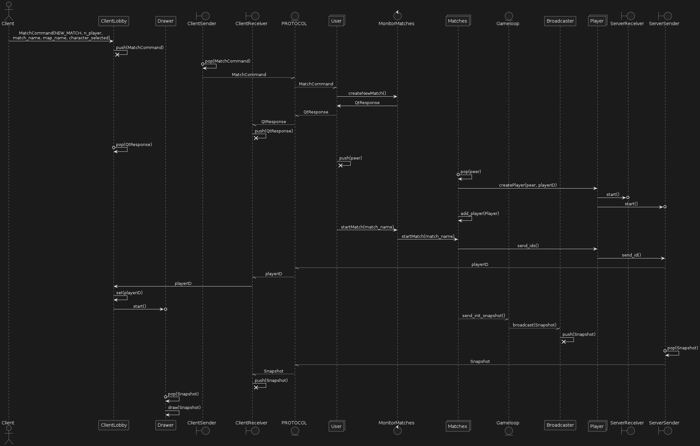

# TECHNICAL DOCUMENTATION OF JAZZ JACKRABBIT 2

This documentation provides a straightforward yet comprehensive overview of the project structure, featuring diagrams accompanied by detailed explanations. It covers thread management, the modeling of key and commonly used classes, and the definition of the protocol.

## SOFTWARE REQUIREMENTS

OS: GNU/Linux

Programming Language: C++

Dependencies:
- SDL2
- SDL2_IMAGE
- SDL2_TTF
- SDL2_MIXER
- QT5
- QT5_MULTIMEDIA
- yaml-cpp
- CMake versión 3.12

Depuration:
- Pre-commit (cppcheck, cpplint, clang-format)
- GDB
- Valgrind

## INTRODUCTION 

The game is divided into two main parts: Server and Client. The Server contains the game logic while the Client is responsible only for connecting to the Server, sending commands to it, and receiving all necessary information to visualize a game session. These two components communicate via sockets, using a communication protocol. The Server includes an acceptor socket, enabling multiplayer functionality.

To elaborate further, the Server manages the state of the game world, processes game rules, and handles interactions between multiple clients. It ensures game consistency and fairness by executing game logic on a centralized platform. Additionally, the Server is responsible for synchronizing game states and broadcasting updates to all connected clients, ensuring that each player has the latest information.

The Client, on the other hand, focuses on user interaction and rendering the game environment based on the data received from the Server. It captures player inputs, such as movements and actions, and transmits them to the Server for processing. Upon receiving updates, the Client updates its display to reflect the current game state, providing a seamless and interactive experience for the player.

Both the Server and Client are designed to be scalable and efficient, capable of handling multiple concurrent connections and providing a smooth gaming experience. The use of a robust communication protocol ensures reliable data transmission and minimizes latency, which is crucial for maintaining game performance and responsiveness.

## SERVER

> Server class diagram 

To understand how everything is connected, let's explain the Server first. To elaborate, the Server handles all aspects of game setup, including the creation and configuration of new matches. This involves allocating resources, initializing game settings, and preparing the game environment for incoming players. By managing these tasks, the Server ensures that each match is correctly configured and ready to provide a smooth gaming experience.

### Running the Server

In the diagram above, we can see that as soon as the Server starts, there will be at least two threads running: the Main and the Acceptor. Additionally, the Config (a Singleton) is also launched. The purpose of the Config is to ensure there is a unique instance of it, from which every other instance within the Server can access and obtain the game's configuration values. One thread (the Main) will be listening for a terminal prompt ('q') to stop the Server, while the other thread (the Acceptor) is responsible for accepting new clients.

Once a Client is accepted, the Acceptor creates a new thread. This new thread's sole purpose is to provide the Client with a pre-game instance. Thanks to this thread, the user can create a new match, join an existing match, or refresh the list of available matches, as shown in the image. During gameplay, the server continues to manage the game's logic, processing player inputs, enforcing game rules, and updating the game state in real time. It synchronizes all clients, ensuring that each player sees a consistent and accurate representation of the game world.

Moreover, when a Client initiates a new match, the Acceptor thread, specifically the MonitorMatches, creates a new thread for each match. The total number of threads can be calculated as: `2 + 2XN`, where `X` is the number of clients and `N` is the number of matches. For example, if there are 2 clients engaged in a single match, the active threads would be: 2 (Main and Acceptor) + (2x2)x1 (each player in a match runs two threads, Sender and Receiver) = 6 threads in total.

By handling both the pre-game setup and the in-game logic, the server plays a pivotal role in maintaining the integrity and functionality of the game, providing a seamless and enjoyable experience for all players.

## PROTOCOL 

> Protocol class diagram

The Protocol class is a critical component in the Client-Server communication architecture of the game. It provides a suite of methods to facilitate the exchange of data between the Client and server. Key functions include send_Snapshot() and receive_Snapshot(), which handle the transmission of game state snapshots. The send_Command() and receive_Command() methods enable the sending and receiving of commands, which are actions or instructions from the Client to the server or vice versa. Additionally, quick responses can be exchanged using send_qt_response() and receive_qt_response().

Central to the command structure is the abstract Command class, which serves as a blueprint for all specific command types. This class defines essential properties and methods, including playerID to identify the player issuing the command. The class also includes pure virtual functions such as executeCommand(), send(), get_playerID(), and get_commandType(), which must be implemented by all derived command classes. Specific commands like Jump, Move, MoveFaster, ChangeWeapon, Shoot, SpecialJazz, SpecialSpaz, SpecialLori, Cheat, and Match inherit from Command and provide concrete implementations for these methods, allowing diverse actions to be executed within the game.

The Snapshot structure plays a crucial role in representing the state of the game at any given moment. This class encapsulates a comprehensive view of the game state, including whether the game has ended and vectors of various snapshots. Each snapshot type, such as RabbitSnapshot, EnemySnapshot, ProjectileSnapshot, and SupplySnapshot, contains detailed attributes relevant to the respective entity. For instance, RabbitSnapshot includes properties like direction, champion type, position (x, y), lives, and ammo. Similarly, EnemySnapshot, ProjectileSnapshot, and SupplySnapshot contain specific data pertinent to their respective entities. Additionally, the Snapshot class integrates the MapDimensions struct, which provides vital details about the game's map, such as its height, width, and the number of rabbits. The DynamicMap class further extends this by representing dynamic aspects of the map, encapsulating the evolving data within the game's environment.

Now that the Protocol has been explained, let's see how some commands are executed. 

### Starting a new Match

> Sequence diagram when starting a new game

When a player on the Client side initiates a request to create a new match, the process begins with the Client sending a MatchCommand containing essential details such as match type, player name, match name, selected map, and chosen character. The ClientLobby, responsible for managing Client interactions within the lobby environment and queues up this MatchCommand for further processing. Next, the Client Sender retrieves the MatchCommand from the queue and transmits it to the server using the specified communication protocol. On the server side, the Server receives this command. The MonitorMatches handles the creation of new matches, ensuring that the server acknowledges the receipt of this command and the creation of the match back to the Client Receiver.

We would like to mention the importance of this MonitorMatches which uses a mutex to ensure thread safety and prevent concurrent access issues when managing the creation and monitoring of matches on the server side. In a multi-threaded environment, multiple threads may attempt to access and modify shared resources (such as the list of matches or player assignments) simultaneously. This can lead to race conditions where the outcome of operations becomes unpredictable or erroneous.

Once the match creation process is underway, MonitorMatches initializes the new match by adding it to the list of ongoing matches and starts the match. This step involves setting up the game environment and assigning necessary identifiers to players within the match context. Simultaneously, on the server side, the Matches component manages the initialization of Players. Each Player object corresponds to a user and includes two threads, ServerSender and ServerReceiver, which facilitate communication with the Client. Each one is then integrated into the newly created match, and the server sends back unique player IDs to the respective clients for identification and initialization purposes.

Upon receiving their player IDs, clients acknowledge and complete their setup through interactions managed by the ClientLobby, which oversees the transition to the game start phase from the Client's perspective.

Once the game is underway, the GameLoop component takes charge of managing the ongoing state and progression of the game on the server side. Periodically, snapshots of the current game state are captured and relayed to the Broadcaster, whose role is to disseminate these updates to all connected clients through the ServerSender component. This ensures that all players receive synchronized updates about the game's state, facilitating a cohesive multiplayer experience.

Finally, on the Client side, the Drawer component continuously receives these game state snapshots and renders them in real-time, providing players with visual feedback based on the latest updates received from the server.

### Executing an action in a game

> Sequence diagram when performing an action within the game

This sequence diagram illustrates the flow of events when a user initiates a move command in the game and how the game state is updated and synchronized across the client and server.

The process begins with the user performing a move action, which is captured by the KeyboardHandler. The KeyboardHandler then pushes a MoveCommand associated with the user's playerID to the ClientSender. It pops the MoveCommand from its queue and sends it to the server using the Protocol. This involves the ClientSender passing the command to the ClientReceiver, which then transmits the command to the server through the Protocol.

Upon receiving the command, the ServerReceiver pushes it to its internal queue. The server's main game loop then pops the command from the queue and executes it using the executeCommand() method. This method updates the game state based on the command, which may involve moving the player to a new position on the map.

After executing the command, the game loop updates the game state and creates a Snapshot representing the current state of the game. This snapshot is pushed to the Broadcaster, which is responsible for sending the updated game state to all connected clients.

The ServerSender pops the snapshot from the Broadcaster's queue and sends it back to the client via the Protocol. The ClientReceiver receives the snapshot and pushes it to the Drawer component. The Drawer then pops the snapshot from its queue and renders the updated game state on the client’s display, ensuring that the user sees the result of their move action and any other changes in the game.

This cycle of sending commands from the client to the server, updating the game state, broadcasting snapshots, and rendering updates on the client side ensures continuous synchronization between the client and server. It maintains a consistent game experience for all players involved, with real-time updates reflecting each player's actions and the overall game state.

## GAME

> Game class diagram

