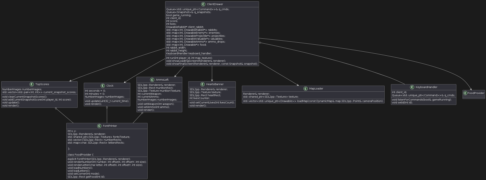
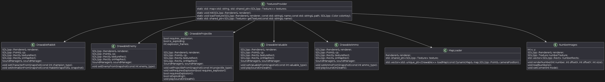

# TECHNICAL DOCUMENTATION OF JAZZ JACKRABBIT 2

This documentation provides a straightforward yet comprehensive overview of the project structure, featuring diagrams accompanied by detailed explanations. It covers thread management, the modeling of key and commonly used classes, and the definition of the protocol.

## SOFTWARE REQUIREMENTS

OS: GNU/Linux

Programming Language: C++

Dependencies:
- SDL2
- SDL2_IMAGE
- SDL2_TTF
- SDL2_MIXER
- QT5
- QT5_MULTIMEDIA
- yaml-cpp
- CMake versión 3.12

Depuration:
- Pre-commit (cppcheck, cpplint, clang-format)
- GDB
- Valgrind

## INTRODUCTION

Jazz Jackrabbit 2, produced by Epic MegaGames in 1998, is a beloved platform game that built upon the success of its predecessor, Jazz Jackrabbit. Both games are side-scrolling platformers that incorporate elements of shooting and platforming. Jazz Jackrabbit 2 introduced enhanced multiplayer options, allowing players to compete or cooperate over a LAN or the Internet, adding a new layer of excitement to the classic gameplay. In this repository, we present a remake of Jazz Jackrabbit 2. Our remake retains the core mechanics of the original game while introducing a new objective: to accumulate the maximum amount of points possible within a set time limit. When the time expires, the player with the most points is declared the winner.

The game is divided into two main parts: Server and Client. The Server contains the game logic while the Client is responsible only for connecting to the Server, sending commands to it, and receiving all necessary information to visualize a game session. These two components communicate via sockets, using a communication protocol. The Server includes an acceptor socket, enabling multiplayer functionality.

To elaborate further, the Server manages the state of the game world, processes game rules, and handles interactions between multiple clients. It ensures game consistency and fairness by executing game logic on a centralized platform. Additionally, the Server is responsible for synchronizing game states and broadcasting updates to all connected clients, ensuring that each player has the latest information.

The Client, on the other hand, focuses on user interaction and rendering the game environment based on the data received from the Server. It captures player inputs, such as movements and actions, and transmits them to the Server for processing. Upon receiving updates, the Client updates its display to reflect the current game state, providing a seamless and interactive experience for the player.

Both the Server and Client are designed to be scalable and efficient, capable of handling multiple concurrent connections and providing a smooth gaming experience. The use of a robust communication protocol ensures reliable data transmission and minimizes latency, which is crucial for maintaining game performance and responsiveness.

#### Queues in Multiplayer Game Communication

In a multiplayer game, effective communication between threads is crucial to ensure smooth gameplay and synchronization between clients and the server. This communication is managed using blocking and non-blocking queues, which help in achieving race-condition-free resource sharing and maintaining synchronization between different components of the game.

On the client side, two primary queues are essential during a match. The first queue is the Command Queue, where the client pushes commands to be sent to the server. These commands can include actions like moving a character, shooting, or using an item. By using this queue, the client ensures that commands are sent in an orderly fashion to the server for processing. The second queue on the client side is the Snapshot Queue. This queue is used to receive game state updates (snapshots) from the server. The Drawer component of the client pulls these snapshots from the queue and renders the current state of the game on the screen. This mechanism ensures that the client’s display is always up-to-date with the latest game state, providing a seamless gaming experience for the user.

On the server side, queues are equally important for managing communication between the server and the clients. The Command Queue on the server is used to pop commands sent by the clients. These commands are then processed to update the game state accordingly. This queue ensures that all client actions are received and handled in a structured manner. The Snapshot Queue on the server is used to push game state updates to the clients. After processing the commands and updating the game state, the server creates snapshots and pushes them into this queue. These snapshots are then sent to the clients to keep their game state synchronized with the server.

Additionally, the server uses a special queue to handle the transition of a user from the lobby to the match. This queue transfers all necessary information about the user, such as their selected character and match preferences, to the match they are connecting to. This ensures that the user is seamlessly integrated into the ongoing match without any loss of data or synchronization issues.

By utilizing these queues, the game can effectively manage communication and data flow between the client and server, ensuring a smooth and synchronized multiplayer experience.

#### Lobby Interface

For the Lobby interface, we used Qt, a powerful framework for creating cross-platform applications. Qt allowed us to design and implement an intuitive and responsive user interface. In the Lobby, users can interact with several buttons to perform various actions:

- Create or edit a Map: Opens a dialog where users can design and save custom maps for their matches.
- Create a Game: Allows users to set up a new game by selecting options such as number of players and map.
- Join a Game: Provides a list of available matches that users can join.

Qt's rich set of widgets and tools enabled us to create these interactive elements efficiently, ensuring a smooth user experience in the Lobby.

#### Game Visualization

Once a game starts, we switch from the Qt-based Lobby interface to the game visualization, which is handled using SDL2pp, a modern C++ wrapper for the SDL (Simple DirectMedia Layer) library. SDL2pp provides a convenient and efficient way to manage game rendering and handle real-time graphics.

- Rendering: SDL2pp is used to render the game state, including player characters, environments, and interactions. It efficiently handles the drawing of textures, animations, and other visual elements, ensuring a high-performance gaming experience.
- Input Handling: SDL2pp captures and processes user inputs, such as keyboard and mouse actions, which are essential for controlling the game. This ensures responsive and accurate in-game actions.
- Audio: SDL2pp also manages the audio, providing immersive sound effects and background music that enhance the overall gaming experience.

By leveraging SDL2pp, we ensure that the game runs smoothly with high-quality graphics and responsive controls. This combination of Qt for the Lobby and SDL2pp for in-game visualization allows us to deliver a seamless and engaging user experience from the moment the user launches the application to the intense moments of gameplay.

## SERVER

> Server class diagram 

To understand how everything is connected, let's explain the Server first. To elaborate, the Server handles all aspects of game setup, including the creation and configuration of new matches. This involves allocating resources, initializing game settings, and preparing the game environment for incoming players. By managing these tasks, the Server ensures that each match is correctly configured and ready to provide a smooth gaming experience.

### Running the Server

In the diagram above, we can see that as soon as the Server starts, there will be at least two threads running: the Main and the Acceptor. Additionally, the Config (a Singleton) is also launched. The purpose of the Config is to ensure there is a unique instance of it, from which every other instance within the Server can access and obtain the game's configuration values. One thread (the Main) will be listening for a terminal prompt ('q') to stop the Server, while the other thread (the Acceptor) is responsible for accepting new clients.

Once a Client is accepted, the Acceptor creates a new thread. This new thread's sole purpose is to provide the Client with a pre-game instance. Thanks to this thread, the user can create a new match, join an existing match, or refresh the list of available matches, as shown in the image. During gameplay, the server continues to manage the game's logic, processing player inputs, enforcing game rules, and updating the game state in real time. It synchronizes all clients, ensuring that each player sees a consistent and accurate representation of the game world.

Moreover, when a Client initiates a new match, the Acceptor thread, specifically the MonitorMatches, creates a new thread for each match. The total number of threads can be calculated as: `2 + 2XN`, where `X` is the number of clients and `N` is the number of matches. For example, if there are 2 clients engaged in a single match, the active threads would be: 2 (Main and Acceptor) + (2x2)x1 (each player in a match runs two threads, Sender and Receiver) = 6 threads in total.

By handling both the pre-game setup and the in-game logic, the server plays a pivotal role in maintaining the integrity and functionality of the game, providing a seamless and enjoyable experience for all players.

## Client
> Client class diagram 

The Client is responsible for interacting with the player. It handles displaying the lobby and drawer interfaces on the screen, as well as capturing and sending the keys pressed by the player.

## PROTOCOL 

> Protocol class diagram

The Protocol class is a critical component in the Client-Server communication architecture of the game. It provides a suite of methods to facilitate the exchange of data between the Client and server. Key functions include send_Snapshot() and receive_Snapshot(), which handle the transmission of game state snapshots. The send_Command() and receive_Command() methods enable the sending and receiving of commands, which are actions or instructions from the Client to the server or vice versa. Additionally, quick responses can be exchanged using send_qt_response() and receive_qt_response().

Central to the command structure is the abstract Command class, which serves as a blueprint for all specific command types. This class defines essential properties and methods, including playerID to identify the player issuing the command. The class also includes pure virtual functions such as executeCommand(), send(), get_playerID(), and get_commandType(), which must be implemented by all derived command classes. Specific commands like Jump, Move, MoveFaster, ChangeWeapon, Shoot, SpecialJazz, SpecialSpaz, SpecialLori, Cheat, and Match inherit from Command and provide concrete implementations for these methods, allowing diverse actions to be executed within the game.

The Snapshot structure plays a crucial role in representing the state of the game at any given moment. This class encapsulates a comprehensive view of the game state, including whether the game has ended and vectors of various snapshots. Each snapshot type, such as RabbitSnapshot, EnemySnapshot, ProjectileSnapshot, and SupplySnapshot, contains detailed attributes relevant to the respective entity. For instance, RabbitSnapshot includes properties like direction, champion type, position (x, y), lives, and ammo. Similarly, EnemySnapshot, ProjectileSnapshot, and SupplySnapshot contain specific data pertinent to their respective entities. Additionally, the Snapshot class integrates the MapDimensions struct, which provides vital details about the game's map, such as its height, width, and the number of rabbits. The DynamicMap class further extends this by representing dynamic aspects of the map, encapsulating the evolving data within the game's environment.

Now that the Protocol has been explained, let's see how some commands are executed. 

### Starting a new Match

> Sequence diagram when starting a new game

When a player on the Client side initiates a request to create a new match, the process begins with the Client sending a MatchCommand containing essential details such as match type, player name, match name, selected map, and chosen character. The ClientLobby, responsible for managing Client interactions within the lobby environment and queues up this MatchCommand for further processing. Next, the Client Sender retrieves the MatchCommand from the queue and transmits it to the server using the specified communication protocol. On the server side, the Server receives this command. The MonitorMatches handles the creation of new matches, ensuring that the server acknowledges (QtResponse) the receipt of this command and the creation of the match back to the Client.

We would like to mention the importance of this MonitorMatches which uses a mutex to ensure thread safety and prevent concurrent access issues when managing the creation and monitoring of matches on the server side. In a multi-threaded environment, multiple threads may attempt to access and modify shared resources (such as the list of matches or player assignments) simultaneously. This can lead to race conditions where the outcome of operations becomes unpredictable or erroneous.

Once the match creation process is underway, MonitorMatches initializes the new match by adding it to the list of ongoing matches and starts the match. This step involves setting up the game environment and assigning necessary identifiers to players within the match context. Simultaneously, on the server side, the Matches component manages the initialization of Players. Each Player object corresponds to a user and includes two threads, ServerSender and ServerReceiver, which facilitate communication with the Client. Each one is then integrated into the newly created match, and the server sends back unique player IDs to the respective clients for identification and initialization purposes.

Upon receiving their player IDs, clients acknowledge and complete their setup through interactions managed by the ClientLobby, which oversees the transition to the game start phase from the Client's perspective.

Once the game is underway, the GameLoop component takes charge of managing the ongoing state and progression of the game on the server side. Periodically, snapshots of the current game state are captured and relayed to the Broadcaster, whose role is to disseminate these updates to all connected clients through the ServerSender component. This ensures that all players receive synchronized updates about the game's state, facilitating a cohesive multiplayer experience.

Finally, on the Client side, the Drawer component continuously receives these game state snapshots and renders them in real-time, providing players with visual feedback based on the latest updates received from the server.

### Executing an action in a game

> Sequence diagram when performing an action within the game

This sequence diagram illustrates the flow of events when a user initiates a move command in the game and how the game state is updated and synchronized across the client and server.

The process begins with the user performing a move action, which is captured by the KeyboardHandler. The KeyboardHandler then pushes a MoveCommand associated with the user's playerID to the ClientSender. It pops the MoveCommand from its queue and sends it to the server using the Protocol. This involves the ClientSender passing the command to the ClientReceiver, which then transmits the command to the server through the Protocol.

Upon receiving the command, the ServerReceiver pushes it to its internal queue. The server's main game loop then pops the command from the queue and executes it using the executeCommand() method. This method updates the game state based on the command, which may involve moving the player to a new position on the map.

After executing the command, the game loop updates the game state and creates a Snapshot representing the current state of the game. This snapshot is pushed to the Broadcaster, which is responsible for sending the updated game state to all connected clients.

The ServerSender pops the snapshot from the Broadcaster's queue and sends it back to the client via the Protocol. The ClientReceiver receives the snapshot and pushes it to the Drawer component. The Drawer then pops the snapshot from its queue and renders the updated game state on the client’s display, ensuring that the user sees the result of their move action and any other changes in the game.

This cycle of sending commands from the client to the server, updating the game state, broadcasting snapshots, and rendering updates on the client side ensures continuous synchronization between the client and server. It maintains a consistent game experience for all players involved, with real-time updates reflecting each player's actions and the overall game state.

## GAME

> Game class diagram

This class diagram illustrates a robust and extensible design using object-oriented principles. The use of inheritance allows for code reuse and a clear hierarchy, facilitating the management and extension of game functionality. The separation of concerns, with distinct classes handling specific game aspects (characters, enemies, weapons, states), promotes maintainability and scalability. Each class encapsulates relevant data and behaviors, supporting a modular approach to game development. At the top of the hierarchy is the PhysicalObject base class from which Character inherits. The PhysicalObject class encapsulates essential attributes and methods related to the physical properties of game objects, such as position, movement, and collision detection.

The Character abstract class defines common attributes and behaviors shared among all game characters. Key attributes include acceleration components, health, and a boolean flags indicating the character's living status. The class also specifies several virtual functions meant to be overridden by derived classes, which manage character state updates, collision handling, and shooting mechanisms.

Inheriting from Character are two significant entities: Rabbit and Enemy. The Rabbit class represents a specific type of character within the game. It includes numerous methods for handling actions specific to the rabbit, including movement, jumping, shooting, and executing special abilities. The Rabbit also interacts with an inventory system and an event queue, essential for game mechanics and user interactions. On the other hand, the Enemy class, represents the adversaries within the game. Key attributes include damage, health_pool, attack_range, and others crucial for defining enemy behavior. Enemies also handle item drops upon its death. The Enemy class has several subclasses, including EnemyTurtle, EnemyCrab, and EnemyLadybug, each representing different enemy types with unique behaviors and attributes.

The Rabbit class is further detailed with multiple state classes such as Alive, Dead, ReceiveDamage, Resurrected and SpecialAttackState. These state classes encapsulate different behaviors and properties the Rabbit can exhibit during gameplay, with each state defining specific actions and responses relevant to the rabbit's current status.

Additionally, the weapon system is detailed through the Gun class, which is used with the Rabbit class. It includes attributes such as ammo, damage, fire_rate, and methods for shooting and managing ammunition. It has several subclasses like Sniper, BasicGun, and MachineGun, each representing different weapon types with distinct behaviors. The Bullet class is associated with the Gun class, representing projectiles fired by the guns, with properties like damage and methods for updating bullet position and handling collisions.

The Map works as a central repository, holding and managing the comprehensive state and dynamics of the game. It integrates various critical components, ensuring a cohesive and interactive gameplay experience. The Map class also manages all game entities through collections like players, enemies, bullets, and items. The players vector holds instances of the Rabbits and the Enemies. Similarly, bullets and items vectors manage active projectiles and interactive objects, respectively. These collections are crucial for maintaining the state of active entities and ensuring their interactions are processed correctly.

Several methods within the Map class are crucial for maintaining and updating the game state. Methods such as check_collision() handle collision detection between various game objects, ensuring that interactions are accurately processed. The reap_dead() method is responsible for removing inactive or dead entities from the game, such as eliminated players or defeated enemies, maintaining an up-to-date game state. The update() method is typically called once per frame to refresh the game logic and entity states, ensuring smooth and continuous gameplay.

By encapsulating diverse elements and interactions, the Map ensures a cohesive and immersive gameplay experience, supporting a modular and maintainable approach to game development. This design allows for efficient updates asked by the game loop, dynamic entity management, and robust interaction handling, crucial for a complex, multi-threaded and engaging game environment.

### Match Lifecycle Management in Multiplayer Games

When a game is active with two or more players and a player leaves, the match itself remains ongoing. The Rabbit controlled by the departing player ceases to perform any actions, effectively becoming inactive. Despite this inactivity, the Rabbit remains part of the game environment and can still be affected by various events, such as special attacks or projectiles from other players.

There are three scenarios where a match can come to an end:

- Server Shutdown: If the server hosting the game is closed, the match ends immediately.
- Game Finishes: This scenario encompasses instances when the game time limit expires.
- All Players Leave: If every player abandons the match, it concludes.

In the cases where a user wins, or all players leave, the match is closed and marked as inactive. If an attempt is made to create a match with a name that is still active, an error will be returned, indicating that the name is currently in use. This ensures that match names are unique and that ongoing matches are not disrupted by attempts to reuse existing names. 

When a match concludes, all associated resources are released appropriately. This includes deallocating memory, closing network connections, and disposing of any game objects to prevent memory leaks. Proper resource management is crucial to ensure that no memory blocks (heap blocks) are left with residual information, which could otherwise lead to increased memory usage and potential crashes. By freeing up these resources, the system maintains optimal performance and stability, allowing new matches to be created and run efficiently.

## How does the lobby work?

> Lobby class diagram

The lobby has a very practical and intuitive way of functioning. Players can select their character and create or join games as they wish. When creating a game, the user can configure it as desired (number of players, map, and game name). After creating the game, the user will enter a waiting room until the selected number of players is reached.

From the join game window, players can view the complete list of all available games. The lobby also allows the player to create and edit maps to their liking, being able to configure various parameters such as the map's height and width, the desired texture, the maximum number of players, each block of the map, and the spawn points for each entity.

## How does the drawer work?

> drawer class diagram

The Drawer class is responsible for managing the game's rendering by following these steps:

1. Listen to the keyboard.
2. Push an incoming command into the protocol queue.
3. Receive the resulting snapshot.
4. Update all existing entities (players, enemies, resources, etc.).
5. Draw.
6. Sleep if there is frame time remaining.

Drawer stores these entities in vectors and knows what type of drawable they are.

### Drawable Hierarchy

The foundation of all drawables is the Drawable class, which represents a static image that can be drawn on the map relative to the camera. A map block or food dropped by enemies are examples of Drawable. They don't do much more than just be there. 

Next, there is a more active class, ShiftingDrawable, which inherits from Drawable. As its name suggests, ShiftingDrawable encompasses entities with animations, meaning they have visible movement in the game. To achieve this, they contain a map pairing animation names (move, jump) with their corresponding frames. Playing these animations requires adding new methods that constantly update the visible frame. ShiftingDrawable also has a reference to the SoundManager object, to emit sounds along with the mentioned animations. 

At the bottom, we find the concrete Drawables, which specialize in a particular entity. They don't do much more than load the corresponding textures and animations. For example, a DrawableRabbit knows which rabbit texture should be loaded based on the player's choice.

> complementary classes

Drawer also has the support of certain classes with which to perform a complete and efficient job.

- HeartsBanner: delegates the task of drawing the player's number of hearts based on their current life.
- AmmoLeft: displays on the screen the type of weapon the player is using and how much ammunition is left.
- Clock: draws the remaining match time.
- TopScores: draws a top 3 of the best scores while playing the game.
- KeyboardHandler: listens to the commands entered by the player and passes them to the protocol.
- MapLoader: loads the map at the start of the game.
- FontsImage: a very useful class, which renders numbers and letters by concatening them.

> ¿when are textures load?

#### The Importance of TextureProvider

To avoid memory and CPU overload, textures are loaded only once at the start of the game. This task falls to TextureProvider, who also remains attentive to requests from various classes wanting to obtain the instance corresponding to their texture.