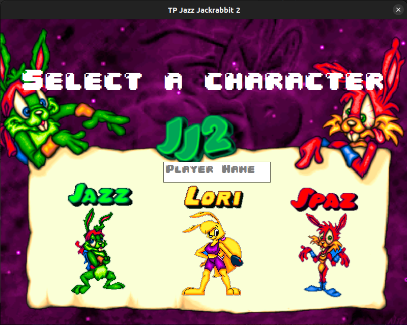
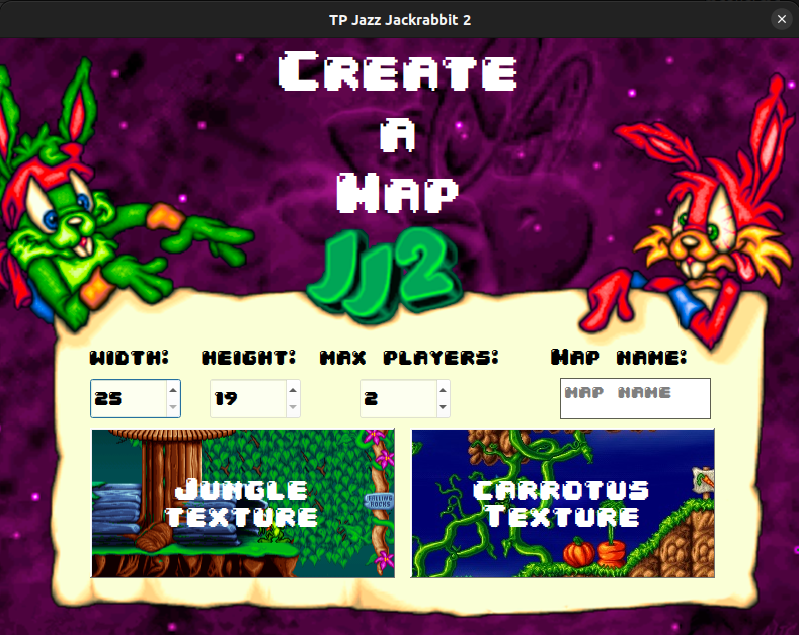
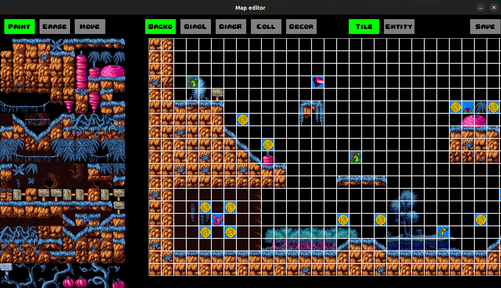
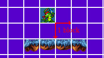
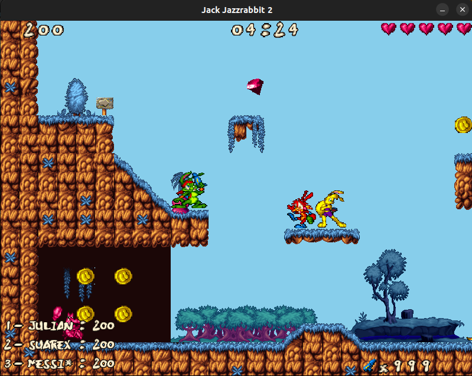
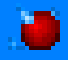
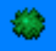
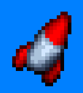

<p align="center">
  
</p>

# USER MANUAL

## Introduction

Welcome to the User Manual for Jazz Jackrabbit 2, your ultimate guide to mastering this exciting and action-packed multiplayer game. Whether you are a new player stepping into the vibrant world of Jazz Jackrabbit for the first time or a seasoned veteran looking to refine your skills, this manual is designed to provide comprehensive instructions and insights to enhance your gaming experience.

We will guide you through the initial setup, including installation and configuration, and explain how to create and join games. You'll learn about the diverse range of characters, their unique abilities, and how to use them effectively in both single-player and multiplayer modes.

Prepare to dive into the adventurous world of Jazz Jackrabbit 2, where every match is a new opportunity for excitement and fun. Let's get started!

## Installing and Launching the Game

1. **Clone this repository**:
   ```
   git clone git@github.com:Taller-de-Programacion-1-1C2024-GRUPO1/TP-Jazz-Jackrabbit-2.git
   ```
2. **Navigate to the project directory**:
   ```
   cd TP-Jazz-Jackrabbit-2
   ```
3. **Install all the dependencies**:
   ```
   chmod +x install_all.sh
   sudo ./install_all.sh
   ```
4. **Build the game**:
   ```
   chmod +x run_all.sh
   sudo ./run_all.sh
   ```
4. **Run the game**:
   > **NOTE**: You need to open two terminals - one dedicated to running the server and another for the client.

   ***Start the Server***:
   ```
   jazz_server <port>
   ```
   Replace `<port>` with the port number you want to use for the server, e.g., `jazz_server 8080`.
   
   > **NOTE**: For each new player, you will need to start a new client.

   ***Start a Client***:
   ```
   jazz_client <host> <port>
   ```
   Replace `<host>` with the hostname or IP address of the server you want to connect to, and `<port>` with the port number used by the server, e.g., `jazz_client localhost 8080`.

## Description

Jazz Jackrabbit 2, produced by Epic MegaGames in 1998, is a beloved platform game that built upon the success of its predecessor, Jazz Jackrabbit. Experience the thrill of Jazz Jackrabbit 2 the ultimate platforming adventure that redefines fun and excitement! Dive into a world bursting with vibrant, hand-drawn graphics and an electrifying soundtrack that will keep you hooked for hours. 

Join Jazz & friends! Jazz is the coolest, fastest, and most daring green rabbit in the galaxy, as he battles his way through diverse, beautifully crafted levels filled with hidden secrets, challenging puzzles, and formidable foes. With its smooth, high-speed gameplay and a wide array of power-ups and weapons, every moment in "Jazz Jackrabbit 2" is an adrenaline-pumping journey.

<p align="center">
   
</p>

But that's not all – the game also boasts an exceptional multiplayer mode, where you can team up with friends or compete against them in a variety of exciting game modes. Whether you're a seasoned gamer looking for a nostalgic trip or a newcomer eager for a fresh, exhilarating experience, Jazz Jackrabbit 2 offers endless entertainment. Don't miss out on this classic gem that has captivated gamers for decades – grab your copy today and embark on an unforgettable adventure!

In this epic world, victory is all about racking up those sweet, sweet points! It's like collecting gems while dodging enemies and blasting through levels, but this time, you're competing against other players.

To come out on top, you gotta hustle and earn as many points as you can. Whether you're snatching up carrots, taking down enemies, or pulling off epic moves, every action gets you closer to victory. When the dust settles and the game ends, the player with the most points takes home the crown!

So, grab your blaster, keep your eyes peeled for goodies, and show off your skills to become the ultimate champion of the Jazz Jackrabbit 2 universe!

## Select a character

Before creating or joining a match you need to choose between three characters: Jazz, Spaz, or Lori. Each character has unique abilities that influence their gameplay.

<p align="center">
   
</p>

### Jazz
Jazz is the main protagonist, a green rabbit with a red bandana. He is known for his agility and combat skills. His special move is the "Uppercut Punch" which allows him to perform a vertical jump without moving laterally, causing damage to everything he touches during the jump.

### Lori
Lori is the sister of Jazz and Spaz, a yellow rabbit with a determined attitude. Her special ability is the "Short-range Kick" a flying kick of short range that she performs while jumping. This action also deals damage to everything she touches.

### Spaz
Spaz, the crazy brother of Jazz, is a red rabbit with a more erratic and aggressive behavior. His special ability is the "Sidekick" which lets him perform a kick that propels him laterally. While he can't jump upwards during this action, he deals damage to everything he touches.

Choose your character wisely, as each one offers a unique gameplay experience and different strategies to overcome the game's challenges.

## How to create a match

When you select to create a match you have several options to customize your game. Here's a step-by-step guide:

> **NOTE**: The default maps supports up to 3 players, allowing for exciting multiplayer action.

1. ***Choose number of players***: You can select the number of players for your match. 

2. ***Name your match***: Give your match a unique name in the "Match Name" field. This helps you and your friends easily identify and join the match.

3. ***Select a map***: You have the option to choose from a variety of maps. Some of the default maps include "Jungle" and "Carrotus." Additionally, you can create your own custom maps for a unique gaming experience.

<p align="center">
   
</p>

Follow these steps to set up your perfect game and enjoy hours of fun with your friends in the vibrant world of "Jazz Jackrabbit 2"!

## How to create a map

### Before you start

> ⚠️ **WARNING: everytime you want to edit or create a map, you MUST start a client inside the project build folder. Otherwise your progress won't be saved and you may experience some exceptions.** ⚠️

**Navigate to the project directory with your client terminal**:
   ```
   cd TP-Jazz-Jackrabbit-2
   ```
**Then access to build folder**:
   ```
   cd build
   ```
**Start your client as usual**:
   ```
   jazz_client <host> <port>
   ```

Server is not attached to this procedure.

### Set map settings

To create a new map in the game, you start by entering the "Create a Map" lobby, as shown in the image. In this lobby, you can customize the following settings for your new map:

1. ***Width and height***: Select the dimensions of the map using the dropdown menus.
2. ***Max players***: Choose the maximum number of players that can play on this map.
3. ***Map name***: Enter a name for your map in the provided text box.
4. ***Textures***: Choose one of the three textures displayed at the bottom of the screen. Each texture represents a different visual theme for your map.

<p align="center">
   
</p>

Once you have configured these settings and selected a texture, clicking on the texture will take you to the HUD (Heads-Up Display) for map editing. 

### HUD: Creating a new map

In the HUD for creating a new map, you can start designing and customizing the details of it using various tools and options provided within the editor. This is where you bring your map to life, adding elements, adjusting layouts, and creating an engaging environment for gameplay.

Here's a breakdown of the different tools available:

1. ***Paint, Erase or Move***:
   - **Paint**: Allows you to add tiles to your map.
   - **Erase**: Allows you to remove tiles from your map.
   - **Move**: In case your map dimensions exceed screen limits, you can access to every spot by clicking and displacing with mouse.

2. ***Editing Options***:
   - **Edit Background**: Lets you modify the background tiles of your map. 
   - **Diagonals Left (DIAGL)**: Enables you to add or edit diagonal tiles sloping to the left.
   - **Diagonals Right (DIAGR)**: Enables you to add or edit diagonal tiles sloping to the right.
   - **Collisonables (COLL)**: Used to designate collision tiles, which are areas that players cannot pass through.
   - **Decorations (DECOR)**: Lets you add decorative elements to enhance the visual appeal of your map.

3. ***Display Options***:
   - **Tiles**: Shows all available tiles that you can use in your map. This is the default view where you can select and place tiles.
   - **Entities**: Allows you to place interactive objects or entities (such as enemies, items, or power-ups) within your map.

4. ***Navigation***:
   - **Save**: Saves your progress. If you don't want to keep your current progress just click on the regular cross that the window provides.

> HUD for creating a new map

<p align="center">
   
</p>

Use these tools to creatively design and customize your map, ensuring it fits the desired gameplay experience!

### Tiles

A map consists of layers. As mentioned in the *Editing Options*, a field is composed of five layers, which are included in the Tile section.
Here are a few points to consider while using these layers:
1. Diagonals Left, Right, and Collidables cannot coexist within a single block. Since these layers are processed differently by the physics engine, only one can remain. If you paint two of these together, the one painted first will be automatically erased.
2. A single block can support up to three layers: background, decorations, and one from the layers mentioned in the first point.
3. The background layer is the deepest, while Decorations is the uppermost. The three middle layers have the same depth, positioned between the Background and Decorations layers.
4. The Tileset on the left does not differentiate textures by layers. Users should find an appropriate texture for each layer. For example, find a sky texture for painting the background.

> ⚠️ **WARNING DO NOT FORGET TO COVER EVERY SIDE OF THE MAP WITH COLLISIONABLE BLOCKS** ⚠️

### Entities

There is an additional layer for entities. Once this option is selected, the texture grid will be replaced by images of game entities. Each represents a spawn point.
There are some restrictions while placing a spawn point on the grid: 
1. You can't spawn entities on the same block as a collidable or diagonal block. 
2. Rabbit and enemy spawns are not allowed to be placed close to a right wall or the ground. There must be at least one block of space between them and a right collidable or the ground. This is because these entities occupy two blocks in height and width, so they need some space to be placed on the map correctly.
3. It is strongly recommended to add entities last. While entities have restrictions with tile blocks, tile blocks do not know about entities' existence. You could draw an enemy, then draw a field block one block below, and in the game, this enemy will be corrupted, probably appearing as if buried.

> How to place a rabbit/enemy correctly 

<p align="center">
   
</p>

### Save progress

> ⚠️ **WARNING: don't forget to set as many rabbits spawn points as the maximum number of players you've selected** ⚠️

The editor provides a button to save your current progress. To ensure a correct save, you must have drawn all the rabbit spawn points you previously defined. If everything is in order, the editor will turn green. If any rabbit spawn points are missing, you will notice a brief change to red.

### Ok... now where's my map?

Once you finished creating or editing your map, close both server and client. A new project compilation is required, as it is needed to update every change made. Then start everything again (client does not need to be started inside build folder anymore as long as you don't need to work with the editor) and enjoy your new map!

## How to join a match

To join a match follow these simple steps based on the provided image:

1. ***Refresh available matches***: Click on the refresh button (indicated by the circular arrow) to update the list of available matches. This ensures you see the most current games you can join.

2. ***Select a match***: From the dropdown menu labeled "Matches Available" choose the match you want to join. This list will display all the active matches that are open for players to join.

3. ***Join the match***: Once you have selected a match, click the "Join" button to enter the game.

<p align="center">
   
</p>

By following these steps, you can quickly join a multiplayer game and start enjoying the action-packed fun of "Jazz Jackrabbit 2" with other players.

## How to configure the game

To configure the game settings, you need to access the configuration file named `config.yml`. You can modify these values to tailor the game's behavior to your liking. After making changes, save the `config.yml` file and build the game again for the new settings to take effect.

> ⚠️ **WARNING: DO NOT PUT NEGATIVE NUMBERS OR ZEROS** ⚠️

[*Click here to access to the configuration file*](../external/config/config.yml)

## In-Game HUD

### In-Game HUD Explanation

The Heads-Up Display (HUD) in the game provides crucial information to the player during gameplay. Here's a detailed explanation of what you can see on the HUD:

<p align="center">
   
</p>

- **Top Left: Current Score**
  - This displays your current score, showing how many points you have accumulated so far in the game.

- **Top Center: Game Time**
  - This shows the remaining time left in your current game session, helping you keep track of how much time you have left to acummulate more points!

- **Top Right: Current Health**
  - This indicates the current health level of your character, allowing you to see how much damage you can still take before dying.

- **Bottom Left: Top Scores**
  - This area displays a top three score between all the current ones in game.

- **Bottom Right: Current Weapon and Ammo Count**
  - This shows the weapon you are currently using and the amount of ammunition you have left for that weapon, ensuring you know when you need to switch weapons.

This HUD layout is designed to provide you with all the necessary information at a glance, ensuring you can focus on the gameplay while still being aware of your score, time, health, top scores, and weapon status.

## Controls

- **Movement**: `←` or `→`
- **Sprint**: `Left Shift` + `←` or `→` 
- **Jump**: `↑`
- **Special Abilities**:
  - Jazz: `Left Ctrl` + `↑`
  - Lori: `Left Ctrl` + `Left Shift` + `↑`
  - Spaz: `Left Ctrl` + `←` / `→` 
- **Shoot**: `Space`
- **Change Weapon**: `Left Alt`
- **Quit Game**: `Escape`

1. **Movement**:
   - Pressing the `→` key moves the character right.
   - Pressing the `←` key moves the character left.
   - Holding `Left Shift` while moving makes the character move faster.

2. **Jumping**:
   - Pressing the `↑` key makes the character jump.

3. **Special Actions**:
   - Holding `Left Ctrl` enables special actions based on the character chosen:
     - Pressing `↑` and `Left Shift` activates "Special Lori".
     - Pressing `→` initiates "Special Spaz" facing right.
     - Pressing `←` initiates "Special Spaz" facing left.
     - Pressing `↑` without `Left Shift` initiates "Special Jazz".

4. **Shooting**:
   - Pressing the `Space` key makes the character shoot.

5. **Weapon Change**:
   - Pressing the `Left Alt` key changes the weapon.

6. **Quit Game**:
   - Pressing `Escape` key quits the game.

This setup allows players to move around, perform various actions, activate cheats, and use special abilities in the game.

## Cheats and Secrets

Surprise! If you have made it to this point of the manual, you are in for a treat. "Jazz Jackrabbit 2" includes some hidden cheats that can enhance your gameplay experience. Here is how to activate them:

1. **Maximum Ammo**:
   - Press `F1` to get maximum ammo for all type of weapon. Do not tell your friends how did you get this secret!

2. **Instant Health Restore**:
   - Press `F2` to instantly restore your health to its maximum. Keep the action going without fear of getting knocked out!

3. **Instant Respawn**:
   - Press `F3` to instantly respawn at a safe location. Get back into the action without delay!

These cheats add an extra element of fun and surprise for players, giving you an edge or allowing you to experiment with the game's mechanics in unexpected ways. Enjoy the adventure and make the most of these hidden secrets!

## Enemies

| Enemy | Description |
|-------|--------|
|  | Watch out for Mr. Crab, scuttling sideways with those big, menacing claws! The crab is small and fast, making it a nimble adversary. If you accidentally step on him, he'll give you a "friendly" pinch, just to say hello! |
|  | Here comes the lazy lizard, it might seem harmless but be careful not to bump into it, though, it's not the friendliest of creatures! Keep your distance and take it out before it gets too close! |
|  | The turtle is a tough nut to crack with its high health. It moves slowly, but don’t be fooled by its pace. If you touch the turtle, it will take away some of your health. Approach with caution and be ready to chip away at its defenses! |

Enemies in this game add a dash of danger and a sprinkle of humor to your adventure. Every time you defeat one of them, you earn a lot of points. Keep your wits about you and don't let their quirky antics catch you off guard!

Whether you're facing off against friends or competing with strangers, remember that they are also enemies! So, keep your reflexes sharp and your aim true as you navigate the battlefield, because every opponent you take down brings you one step closer to the top of the scoreboard! Whether it's a friendly rivalry or an all-out showdown, victory over other players means not only survival but also earning those coveted points to show off your dominance in the "Jazz Jackrabbit 2" game world.

### Drops

#### Weapons and Ammo

> REMEMBER: To change your current weapon in a match, press the `W` key.

| Ammo | Description |
|-------|--------|
| | This fiery weapon unleashes a continuous stream of scorching flames, causing constant damage to anything in its path. Perfect for dealing with multiple enemies at once, the flamethrower turns up the heat and leaves a trail of destruction. Just hold down the trigger and watch your foes burn! |
|  | The raygun packs a powerful punch in a short-range blast. This high-tech weapon delivers a burst of energy that does a lot of damage, making it ideal for close encounters. When enemies get too close for comfort, the raygun's intense firepower ensures they won't stay there for long. |
|  | For those who prefer to take out enemies from a distance, the rocket launcher is the perfect choice. This long-range weapon deals a significant amount of damage, allowing you to pick off foes before they even know what's hit them. With pinpoint accuracy and devastating power, the rocke launcher turns you into a lethal sharpshooter. |

#### Food

Enemies don't just leave the battlefield empty-handed! As you defeat them, they may drop various types of food that not only provide points but also offer special benefits. 

However, **be cautious**: not all food is created equal! `Carrots`, for example, not only give you points but also restore your health, providing extra hearts to keep you going. But watch out for the `Rotten cheese` - rabbits don't like it! If you accidentally eat rotten cheese, it can damage and stun you, leaving you vulnerable to enemy attacks. So, while collecting food can boost your score and keep you healthy, make sure to avoid the spoiled snacks that might turn the tide against you!

## Items

| Item | Description |
|-------|--------|
| | Snagging a gold coin is like striking it rich, instantly boosting your score and filling your pockets with riches. But watch out, they're often guarded by tough enemies or hidden behind tricky obstacles. Only the most daring and skilled players can claim the coveted gold coins and prove themselves as true treasure hunters! |
|  | Glittering treasures scattered throughout the levels, tempting players with their mesmerizing glow. These sparkling jewels do not just look pretty, they are your ticket to boosting your score! Each gem you collect adds precious points to your tally, making them essential for climbing the leaderboard and claiming victory. Keep your eyes peeled for these shimmering beauties as you dash, jump, and blast your way through the game, because every gem you grab brings you one step closer to triumph! |

## How to close the game

When you are in the game groove with your crew, but suddenly decide it is time to peace out, you can click that little `X` up in the top-right corner.

Now, there are three ways the party can wrap up:

- **Server Shutdown**: If the server calls it quits, that's game over, folks!
- **Time's Up**: When the clock hits zero, it's time to call it a day.
- **Empty Nest**: If everyone decides to hit the road, the party's officially over.

When the game session ends, either because it's finished or because you have decided to leave, you will see the scoreboard pop up. It is a summary of everyone's performance during the game. You can see who scored the most points, who got the most kills, or any other achievements earned during the match. It is a cool way to see how everyone did and celebrate the winners before you head out.

<p align="center"></p>

-------

### **Congratulations, you have now got all the tools and tips you need to master Jazz Jackrabbit 2! From understanding the controls and special ammos to knowing your enemies and collecting valuable points, you're well-prepared to jump into the action. Remember, practice makes perfect, so keep honing your skills and discovering all the secrets the game has to offer. Whether you are playing solo or challenging friends, may your adventures be filled with high scores, epic victories, and endless fun. Thank you very much for reading the entire manual. Here's a gift from the developers: "DIPA". Now, go out there and show the world what a true Jazz Jackrabbit hero looks like! Happy hopping!**

<p align="center"></p>